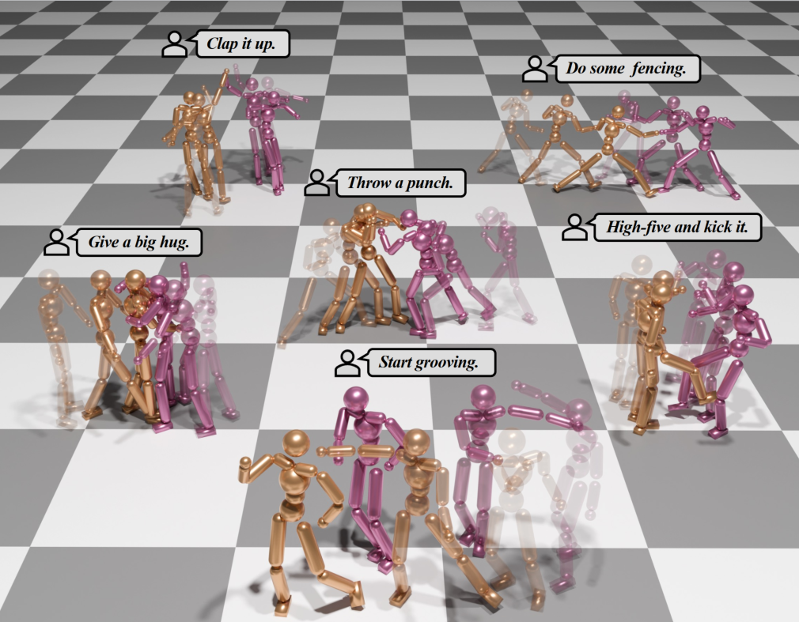

<h1 align="center">
  InterAgent: Physics-based Multi-agent Command Execution via Diffusion on Interaction Graphs
</h1>

<h3 align="center">
  🎉 CVPR 2026
</h3>
<p align="center">
  <a href="https://binlee26.github.io/InterAgent-Page/">
    
  </a>
  <a href="https://arxiv.org/pdf/2512.07410">
    
  </a>
  <a href="https://huggingface.co/BinLi0206/InterAgent">
    
  </a>
  
</p>

<!-- Author Information Section -->
<p align="center">
  <!-- Authors -->
  <a href="">Bin Li</a><sup>* 1</sup>&nbsp;&nbsp;&nbsp;&nbsp;
  <a href="">Ruichi Zhang</a><sup>* 2</sup>&nbsp;&nbsp;&nbsp;&nbsp;
  <a href="">Han Liang</a><sup>† 3</sup>&nbsp;&nbsp;&nbsp;&nbsp;
  <a href="">Jingyan Zhang</a><sup>1</sup>
  <br>
  <a href="">Juze Zhang</a><sup>4</sup>&nbsp;&nbsp;&nbsp;&nbsp;
  <a href="">Xin Chen</a><sup>3</sup>&nbsp;&nbsp;&nbsp;&nbsp;
  <a href="">Lan Xu</a><sup>1</sup>&nbsp;&nbsp;&nbsp;&nbsp;
  <a href="">Jingyi Yu</a><sup>1</sup>&nbsp;&nbsp;&nbsp;&nbsp;
  <a href="">Jingya Wang</a><sup>† 1,5</sup>
  <br><br>
  <!-- Affiliations -->
  <sup>1</sup>ShanghaiTech University&nbsp;&nbsp;&nbsp;&nbsp;
  <sup>2</sup>University of Pennsylvania&nbsp;&nbsp;&nbsp;&nbsp;
  <sup>3</sup>ByteDance&nbsp;&nbsp;&nbsp;&nbsp;
  <sup>4</sup>Stanford University&nbsp;&nbsp;&nbsp;&nbsp;
  <sup>5</sup>InstAdapt
    
  <br>
  <!-- Legend -->
  <em><small><sup>*</sup>Equal contribution&nbsp;&nbsp;&nbsp;&nbsp;<sup>†</sup>Corresponding Author</small></em>
</p>

<p align="center">
  
</p>

---

## ✨ Overview

**InterAgent** is the first end-to-end framework for **text-driven physics-based multi-agent humanoid control**.

It introduces:

- 🧠 An **autoregressive diffusion transformer**
- 🔀 Multi-stream blocks decoupling proprioception, exteroception, and action
- 🔗 A novel **interaction graph exteroception representation**
- ⚡ Sparse edge-based attention for robust interaction modeling

InterAgent produces **coherent, physically plausible, and semantically faithful multi-agent behaviors** from only text prompts.

---

## 🛠️ Installation

Clone the repository and create the environment:

```bash
git clone https://github.com/BinLee26/InterAgent.git
cd InterAgent

conda create -n interagent python=3.8 -y
conda activate interagent

conda install pytorch torchvision torchaudio pytorch-cuda=12.1 -c pytorch -c nvidia
pip install -e .
```

---

## 🗃️ Data Preparation

### 1️⃣ Download Training Data

Download the training file:

```
interhuman_train.pkl
```

from [HuggingFace](https://huggingface.co/BinLi0206/InterAgent) and place it under:

```
data/
```

### 2️⃣ (Optional) Track Your Own Data

We rely on the official [ASE](https://github.com/nv-tlabs/ASE) implementation to obtain tracking state-action pairs.

If you wish to track your own motion data:

- Modify ASE to support **two agents**
- You may refer to the implementation in
`
./inference
`
for a working example of the two-agent setup.

### 3️⃣ Build LMDB Dataset

After downloading the data, run:

```bash
python training/interagent/dataset/dataset_create_lmdb.py
```

---

## 🔥 Training

To train the policy network:

```bash
bash scripts/train.sh
```

You may modify hyperparameters inside the corresponding config files if needed.

---

## 🤖 Inference

### 1️⃣ Environment Setup

Follow the setup instructions in the official  
[ASE repository](https://github.com/nv-tlabs/ASE)  
to configure the simulation environment.

### 2️⃣ Download Checkpoint

Download the pretrained checkpoint from [HuggingFace](https://huggingface.co/BinLi0206/InterAgent) and place it in
`
checkpoint/
`

### 3️⃣ Run Inference

```bash
cd inference/multi-agent
bash infer.sh
```

---

## 📝 Citation

If you find our work useful, please consider citing:

```bibtex
@article{li2025interagent,
  title={InterAgent: Physics-based Multi-agent Command Execution via Diffusion on Interaction Graphs},
  author={Li, Bin and Zhang, Ruichi and Liang, Han and Zhang, Jingyan and Zhang, Juze and Chen, Xin and Xu, Lan and Yu, Jingyi and Wang, Jingya},
  journal={arXiv preprint arXiv:2512.07410},
  year={2025}
}
```

---

## 🙏 Acknowledgments

This project partially builds upon several excellent open-source works:

- [PDP](https://github.com/Stanford-TML/PDP/tree/main)
- [InterGen](https://github.com/tr3e/InterGen)
- [ASE](https://github.com/nv-tlabs/ASE)

We sincerely thank the authors for making their code publicly available.

---

## 📜 License

Please refer to the `LICENSE` file for details.